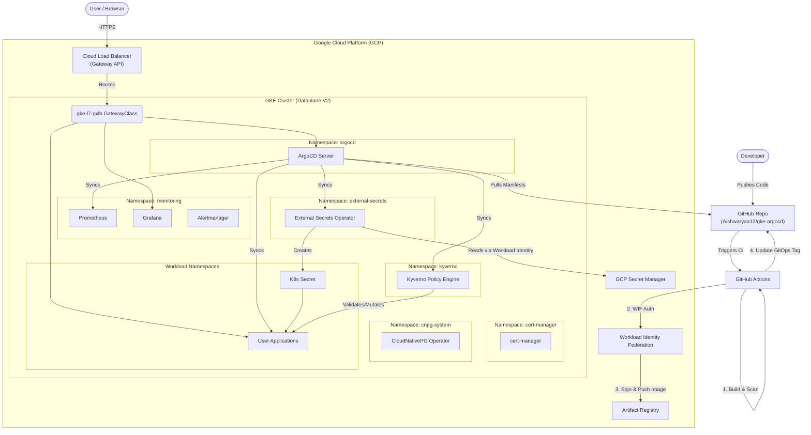

# Architecture Overview

This document outlines the high-level architecture of the GKE GitOps environment.

## Key Components

1. **Infrastructure as Code (Terraform)**: Provisions the GKE cluster (Dataplane V2), VPC network, IAM roles, Workload Identity, Secret Manager, and Artifact Registry.
2. **GitOps (ArgoCD)**: Continuously syncs Kubernetes manifests from the `gitops/apps` directory, ensuring the cluster state matches Git.
3. **Ingress (Gateway API)**: Replaces traditional ingress controllers by integrating directly with GCP Cloud Load Balancing for routing external traffic.
4. **Secrets Management (External Secrets Operator)**: Syncs sensitive data from GCP Secret Manager into native Kubernetes Secrets using Workload Identity (no service account keys).
5. **Observability (kube-prometheus-stack)**: Provides cluster metrics, alerting, and dashboards via Prometheus and Grafana.
6. **Policy Enforcement (Kyverno)**: Enforces security best practices such as disallowing the `:latest` image tag, requiring resource limits, and preventing privilege escalation.
7. **Database Operations (CloudNativePG)**: Manages PostgreSQL clusters natively within Kubernetes, handling replication, failover, and backups.
