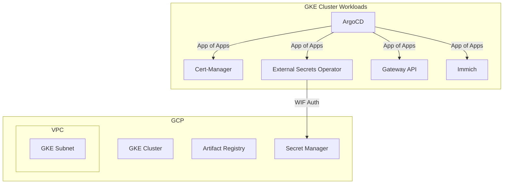

# GKE + ArgoCD Platform Engineering Setup

A production-grade, modular Terraform configuration that provisions a **GKE Standard** cluster, custom VPC, and deploys **ArgoCD** via the `App of Apps` GitOps pattern.

---

## 🏗️ Architecture



---

## 📁 File Structure

```
gke-argocd/
├── modules/
│   ├── networking/   # VPC, Subnets, Firewalls
│   ├── gke/          # Cluster and Node Pools
│   └── iam/          # Workload Identity, Service Accounts
├── gitops/
│   ├── apps/           # ArgoCD Application manifests (App of Apps)
│   └── infrastructure/ # Kubernetes manifests for cluster tooling
├── main.tf           # Root module calling networking, gke, iam
├── argocd.tf         # Bootstraps ArgoCD & App of Apps
├── secrets.tf        # GCP Secret Manager resources
├── variables.tf
└── outputs.tf
```

---

## 🚀 Deployment Workflow

### 1. Authenticate with GCP

```bash
gcloud auth login
gcloud auth application-default login
gcloud config set project project-68d4f10e-27fc-4ab1-ab5
```

### 2. Initialise and Plan

```bash
terraform init
terraform plan
```

### 3. Apply Infrastructure

```bash
terraform apply
```

> **What happens?**
> 1. Terraform creates the VPC, Subnet, IAM roles, and GKE cluster.
> 2. Terraform installs ArgoCD into the cluster via Helm.
> 3. Terraform deploys the "Root App of Apps" to ArgoCD.
> 4. ArgoCD takes over and continuously synchronizes `cert-manager`, `external-secrets`, the Gateway API, and `immich` from the GitHub repository.

---

## 🔐 Secrets Management

We use **External Secrets Operator** (ESO) authenticated via **Workload Identity Federation** (WIF). 

1. Passwords and API tokens are created securely in **Google Secret Manager** (`secrets.tf`).
2. The ESO runs in the cluster and assumes the `external-secrets-sa` GCP Service Account.
3. ESO syncs GCP Secrets into native Kubernetes `Secret` objects automatically.

---

## 🌐 GitOps App of Apps

Instead of defining Kubernetes resources tightly coupled within Terraform state, this repository embraces a **True GitOps** approach.

- **Infrastructure layer**: Terraform provisions the raw compute and permissions.
- **Platform layer**: ArgoCD acts as the continuous delivery tool, syncing the `gitops/` folder.
- **Application layer**: Immich and other apps are deployed purely via Git commits.
