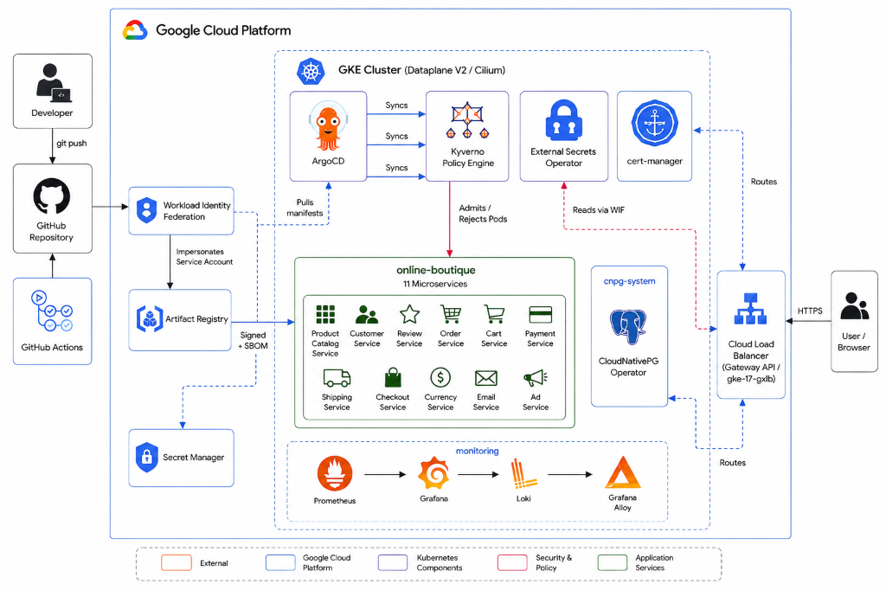

# GKE, Terraform, and ArgoCD: Platform Engineering Reference Architecture

> **About:** A production-ready Platform Engineering reference architecture demonstrating a modern, secure, and fully automated cloud-native ecosystem. It features a hardened GKE cluster provisioned via Terraform, an ArgoCD GitOps control plane, and a complete SLSA-aligned supply chain CI/CD pipeline deploying the 11-microservice Google Online Boutique application.

## Stack Overview

* **Infrastructure as Code**: Terraform, Google Kubernetes Engine (GKE)
* **GitOps**: ArgoCD
* **Continuous Integration**: GitHub Actions
* **Security & Policy**: Kyverno, External Secrets Operator, Cosign, Sigstore
* **Observability**: Prometheus, Loki, Grafana, Grafana Alloy
* **Database**: CloudNativePG (PostgreSQL)
* **Networking**: Kubernetes Gateway API, Dataplane V2 (Cilium)

## Architecture Overview

The architecture is divided into three core layers.

1. **The Infrastructure Layer**: Terraform manages the foundational Google Cloud Platform (GCP) resources. This includes the Virtual Private Cloud (VPC), the GKE cluster, IAM service accounts, and Artifact Registry.
2. **The Platform Layer**: ArgoCD acts as the engine of the platform. It continuously synchronizes the state of the cluster with the Git repository. 
3. **The Application Layer**: The Google Online Boutique demo runs on top of the platform. It consists of 11 distinct microservices (like Cart, Payment, and Catalog) that communicate securely within the cluster.

## Key Architectural Decisions

Several specific technical choices ensure the platform remains secure, highly scalable, and easy to maintain over time.

### 1. Gateway API over Traditional Ingress
The Kubernetes Gateway API is used instead of traditional ingress controllers like NGINX. The Gateway API integrates directly with Google Cloud Load Balancing. This enables native Google Cloud features like managed TLS certificates, Cloud Armor, and global Anycast IPs without managing a separate third party ingress controller. It also provides a cleaner, role oriented routing model.

### 2. CloudNativePG over Managed Cloud SQL
PostgreSQL is deployed inside the cluster using the CloudNativePG operator instead of relying on a managed service like Google Cloud SQL. This approach keeps cloud costs significantly lower while still providing enterprise grade database features. The operator automatically handles streaming replication, failover, and point in time recovery backups directly to Google Cloud Storage.

### 3. GKE Dataplane V2
GKE Dataplane V2 replaces the standard kube proxy. Dataplane V2 is based on eBPF technology (Cilium). It delivers significantly higher networking performance, advanced NetworkPolicies, and deeper network visibility without the performance overhead of legacy iptables rules.

### 4. External Secrets Operator over Sealed Secrets
The External Secrets Operator (ESO) integrates with Google Cloud Secret Manager via Workload Identity. ESO natively syncs secrets from a centralized and audited vault into Kubernetes native Secrets. This avoids the risk of checking encrypted secrets into Git. It also creates a clear separation of concerns. Terraform provisions the vault and access roles, while GitOps handles the synchronization.

### 5. Strict ApplicationSet Path Convention
A strict directory structure is adopted for all Helm based workloads. An ArgoCD ApplicationSet uses a Git Directory Generator targeting the workloads folder. The ApplicationSet relies on the folder path to dynamically determine the target namespace. Because of this automated mapping, the directory depth must remain exact to prevent deployments from failing.

## Supply Chain Security Pipeline

To ensure that only trusted code runs in the cluster, a GitHub Actions workflow implements a complete, SLSA aligned supply chain for all 11 microservices. 

1. **Static Analysis**: Whenever code is pushed, a Trivy SAST scan runs directly on the source code to catch vulnerabilities early.
2. **Keyless Authentication**: The pipeline authenticates to Google Cloud via Workload Identity Federation. This removes the massive security risk of storing long lived Service Account JSON keys in GitHub.
3. **Build and Scan**: The pipeline builds the Docker image and tags it with the exact Git commit hash. A second Trivy scan checks the built container image for critical vulnerabilities before it can be pushed.
4. **Sign and Attest**: The verified image is pushed to Artifact Registry. It is then cryptographically signed using Cosign keyless signing via the Sigstore transparency log. Finally, a Software Bill of Materials (SBOM) is generated, attached to the image, and signed.
5. **GitOps Update**: Once all builds and scans pass successfully, a final job automatically commits the new image hashes into the ArgoCD configuration. ArgoCD detects the change and deploys the new images.

## Cluster Security Posture

The cluster enforces a strong security baseline using Kyverno admission policies. This guarantees that workloads cannot bypass the established rules.

* **Admission Time Verification**: Kyverno intercepts every pod creation request. It rejects any pod in the application namespace that is not cryptographically signed by the official GitHub Actions workflow.
* **No Latest Tags**: A policy blocks all container images that rely on the ambiguous `latest` tag. Images must have explicit, digest separated tags.
* **Privilege Restrictions**: Policies require pods to run as a non root user, drop all Linux capabilities, and strictly prevent privilege escalation.
* **Resource Limits**: Every pod must define explicit CPU and memory requests and limits to prevent noisy neighbor problems.
* **Node Security**: Shielded Nodes with Secure Boot and Integrity Monitoring are enabled across the cluster. The Workload Metadata server is protected to prevent pods from accessing the host machine credentials.
* **Least Privilege**: The node service account is restricted to basic logging, monitoring, and registry pull permissions.
