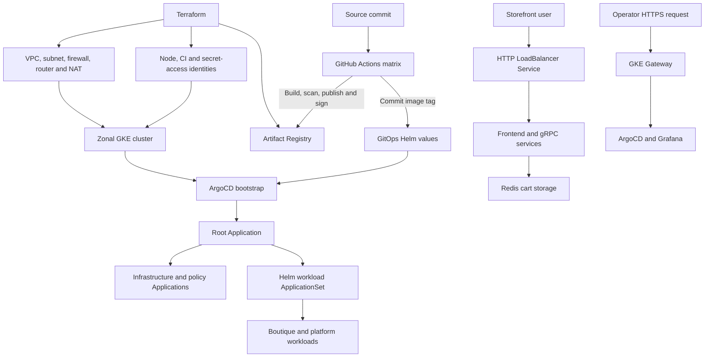

# GKE Platform Engineering with Terraform and ArgoCD

> **Archived project:** The GKE cluster is no longer running. This repository is retained as a public archive for reference and is no longer actively maintained. The configuration and service endpoints below are historical and do not represent a currently running deployment.

A cloud platform project that provisions Google Kubernetes Engine with Terraform and delivers Google's Online Boutique sample through GitHub Actions and ArgoCD.

The project connects infrastructure provisioning, cloud identity, container builds, artifact signing, Kubernetes policy, and GitOps delivery in one repository. It demonstrates platform integration around an existing application, with documented boundaries between implemented configuration and remaining operational work.

## Project highlights

- **Infrastructure as code:** Terraform modules manage networking, IAM, a zonal GKE cluster, and its autoscaling node pool.
- **GitOps delivery:** Terraform installs ArgoCD and its root Application. An ApplicationSet discovers Helm workloads by directory convention.
- **Federated CI identity:** GitHub Actions authenticates to Google Cloud through Workload Identity Federation, restricted to this repository's `main` branch.
- **Artifact traceability:** Images receive commit SHA tags, Cosign signatures, and signed SPDX SBOM attachments generated with Syft.
- **Workload controls:** Boutique templates configure non-root execution, dropped capabilities, no privilege escalation, read-only root filesystems, and resource requests/limits.
- **Platform services:** The repository includes metrics, logs, tracing, certificate management, policy enforcement, and a separate PostgreSQL operator example.

## Architecture


```mermaid
flowchart TD
    TF[Terraform] --> Network[VPC, subnet, firewall, router and NAT]
    TF --> IAM[Node, CI and secret-access identities]
    Network --> GKE[Zonal GKE cluster]
    IAM --> GKE
    TF --> GAR[Artifact Registry]
    GKE --> Argo[ArgoCD bootstrap]
    Argo --> Root[Root Application]
    Root --> Platform[Infrastructure and policy Applications]
    Root --> AppSet[Helm workload ApplicationSet]
    AppSet --> Workloads[Boutique and platform workloads]

    Source[Source commit] --> CI[GitHub Actions matrix]
    CI -->|Build, scan, publish and sign| GAR
    CI -->|Commit image tag| GitOps[GitOps Helm values]
    GitOps --> Argo

    User[Storefront user] --> LB[HTTP LoadBalancer Service]
    LB --> Frontend[Frontend and gRPC services]
    Frontend --> Redis[Redis cart storage]

    Operator[Operator HTTPS request] --> Gateway[GKE Gateway]
    Gateway --> Dashboards[ArgoCD and Grafana]
```

The storefront and management interfaces use different entry paths. Boutique exposes `frontend-external` as an HTTP LoadBalancer Service on port 80, targeting frontend port 8080. The shared HTTPS Gateway routes `argo.cralyx.com` to ArgoCD and `dash.cralyx.com` to Grafana.

## Infrastructure and identity

| Area | Configuration |
|---|---|
| Network | Custom VPC, regional subnet, separate Pod and Service secondary ranges |
| Address ranges | Nodes: `10.0.0.0/20`; Pods: `10.48.0.0/14`; Services: `10.52.0.0/20` |
| GKE | Zonal cluster, Dataplane V2, Workload Identity, Gateway API, authorized control-plane networks |
| Node pool | `e2-standard-2` default, autoscaling from 1 to 5 nodes, automatic repair and upgrades |
| Node security | Secure Boot, integrity monitoring, GKE metadata mode, dedicated node service account |
| Outbound networking | Cloud Router, Cloud NAT, and Private Google Access |
| Terraform state | GCS backend with a configured bucket and state prefix |
| Registry | Regional Artifact Registry Docker repository |

The node identity has logging, monitoring, and registry-read roles. CI uses a separate service account with writer access to the application registry repository. The federation provider checks both repository identity and `refs/heads/main`.

The default initial node count is one; the example variables file sets three. Cloud NAT does not by itself establish a private-node cluster, and no explicit private-cluster configuration is included.

## Build and release workflow

The [GitHub Actions workflow](.github/workflows/boutique-ci.yaml) runs for source or workflow changes on `main`, and supports manual dispatch.

1. Select the Docker build context for each service.
2. Run a Trivy filesystem scan.
3. Authenticate to Google Cloud using GitHub OIDC federation.
4. Build an image tagged with the source commit SHA.
5. Run a Trivy image scan and push to Artifact Registry.
6. Sign the image with Cosign, generate an SPDX SBOM with Syft, and attach and sign that SBOM.
7. After all matrix jobs succeed, update the shared image tag in Boutique's Helm values and commit it to Git.
8. ArgoCD reconciles the updated workload configuration.

Both Trivy scans are currently advisory: vulnerability findings use `exit-code: '0'`. Image signatures and SBOMs provide artifact identity and inventory, but the workflow does not declare a formal SLSA level or generate complete build provenance.

The matrix builds twelve images, including the shopping assistant. The checked Boutique chart deploys eleven custom images, including the load generator, plus public Redis. The shopping assistant is disabled and has no deployment template in this chart.

## GitOps organization

Terraform owns the cloud foundation, ArgoCD Helm release, and root Application. ArgoCD owns the downstream Kubernetes configuration.

The ApplicationSet discovers:

```text
gitops/workloads/helm/<namespace>/<application>
```

The last directory determines the Application name, and the namespace comes from the path. Generated Applications enable automated synchronization, pruning, self-healing, and namespace creation. Directory depth and unique application names are therefore part of the deployment contract.

| Path | Contents |
|---|---|
| [`modules/networking/`](modules/networking/) | VPC, subnet, firewall rules, router, and NAT |
| [`modules/gke/`](modules/gke/) | Cluster and node pool |
| [`modules/iam/`](modules/iam/) | Service accounts, IAM grants, and federation |
| [`main.tf`](main.tf) | Module composition, state-address migrations, and ArgoCD bootstrap |
| [`.github/workflows/`](.github/workflows/) | Container build and GitOps promotion pipeline |
| [`gitops/argocd/`](gitops/argocd/) | Child Applications and Helm ApplicationSet |
| [`gitops/infrastructure/`](gitops/infrastructure/) | Gateway routes, health checks, certificates, network policies, and secret store |
| [`gitops/policies/`](gitops/policies/) | Kyverno validation policies |
| [`gitops/workloads/helm/`](gitops/workloads/helm/) | Application and platform charts |
| [`gitops/workloads/raw/`](gitops/workloads/raw/) | Additional manifests not currently selected by an ArgoCD source |
| [`src/online-boutique/`](src/online-boutique/) | Vendored sample application source and Dockerfiles |

## Security and observability

Kyverno policies declare enforcement for non-root execution, capability dropping, privilege-escalation restrictions, resource limits, and image-tag checks, with explicit platform-namespace exclusions. Boutique templates also supply resource requests and RuntimeDefault seccomp settings. The resource policy checks limits; it does not require requests.

Gateway certificates use cert-manager with Cloudflare DNS-01. HealthCheckPolicies configure the managed load balancer's checks for ArgoCD and Grafana. Separate NetworkPolicies restrict ingress to those management workloads. Boutique's optional application NetworkPolicies and service-mesh configuration are disabled.

The telemetry configuration brings together:

- **Prometheus and Grafana:** Seven-day metrics retention with a 20Gi Prometheus claim and 5Gi Grafana persistence.
- **Alloy and Loki:** Kubernetes log collection and a filesystem-backed Loki deployment.
- **OpenTelemetry and Tempo:** Instrumented services export to a collector Deployment, which forwards traces to Tempo.

Trace instrumentation is partial. Shipping's tracing implementation is a placeholder. Alloy and Tempo wrapper values also need correction and rendered-chart validation before claiming complete telemetry coverage or durable trace storage. Alertmanager currently routes to a null receiver, so external notification delivery is not configured.

## Database example

CloudNativePG declares a separate two-instance PostgreSQL cluster, with 10Gi storage per instance and a daily backup schedule targeting GCS. Boutique's cart service uses Redis, not this PostgreSQL cluster. Redis uses `emptyDir`, so cart data does not survive Pod replacement.

The PostgreSQL example demonstrates operator-managed database configuration. Backup bucket provisioning, workload permissions, and successful restore validation remain necessary before claiming a working recovery process.

## Known limitations at archival

- **Reproducible bootstrap:** Document and provision the state bucket, Git repository credentials, Cloudflare token, and required cloud APIs. Separate cluster/operator readiness from dependent custom-resource creation.
- **Admission verification:** Connect the raw image-signature policy to an ArgoCD source and validate it against the pinned Kyverno version. Its presence in Git does not currently establish enforcement.
- **Secret delivery:** Complete the External Secrets identity configuration and add ExternalSecret mappings. The existing ClusterSecretStore and IAM definitions are only part of that path.
- **Release safety:** Add explicit application tests, enforced vulnerability policy, pinned tool revisions, serialized promotion, and deployment health checks.
- **Reliability:** Establish backup/restore evidence, application scaling and disruption controls, HTTPS storefront routing, and working alert delivery.

This is a platform engineering demonstration. Production suitability depends on closing these gaps and validating the resulting behavior under deployment, failure, and recovery scenarios.

## Application attribution

Online Boutique is Google's sample microservices application. Its source and chart retain upstream copyright and license notices. The portfolio focus here is the infrastructure, delivery pipeline, GitOps organization, and platform configuration around that application.
